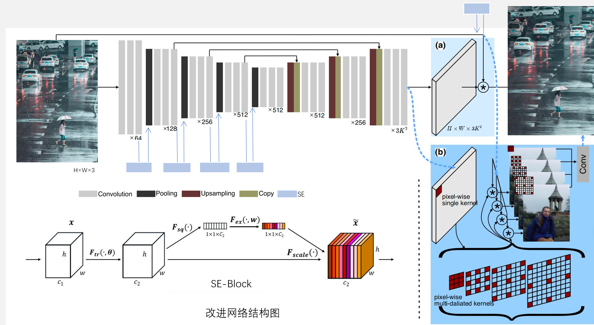
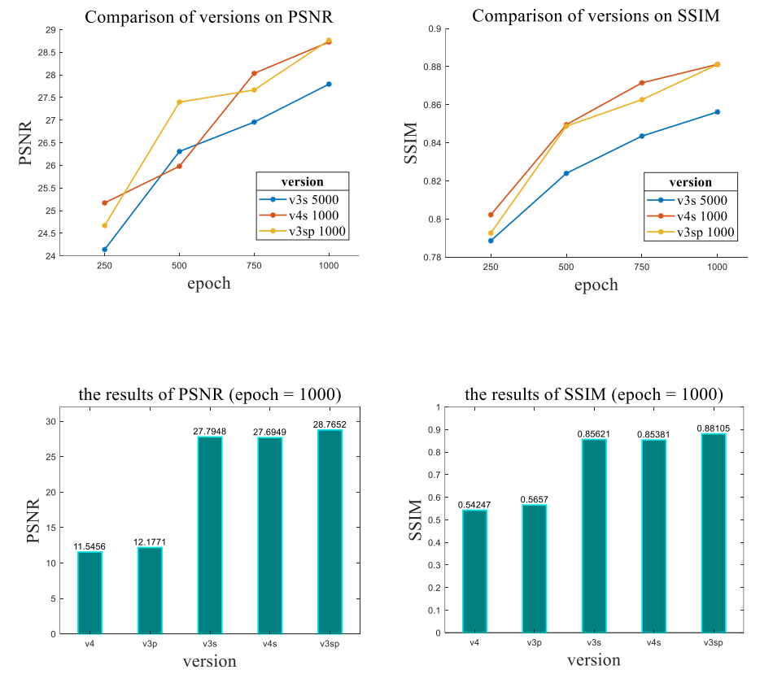
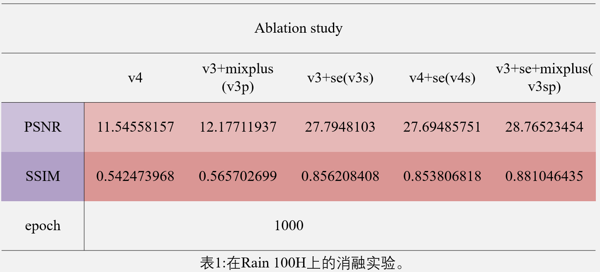
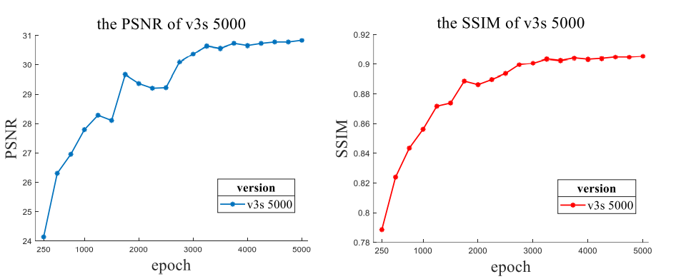
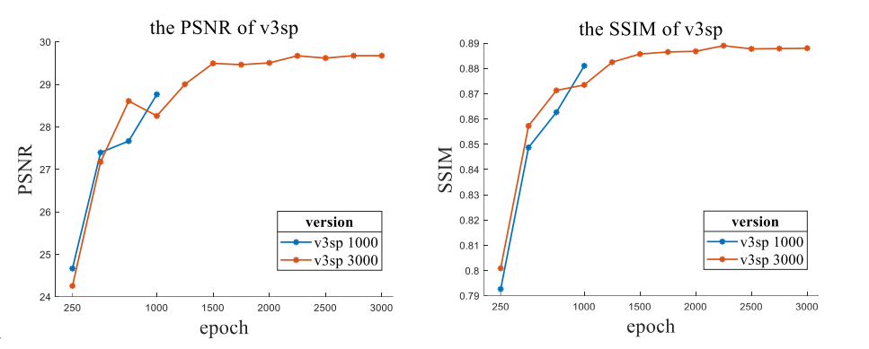

# Efficientplus derain(EPD)

We propose a model based on EfficientDerain for high-efficiency single-image deraining.

We add SEblocks into the network, and change the rainmix method a little;

the original paper: [tsingqguo/efficientderain: we propose EfficientDerain for high-efficiency single-image deraining (github.com)](https://github.com/tsingqguo/efficientderain)



## Requirements

- python 3.6
- pytorch 1.6.0
- opencv-python 4.4.0.44
- scikit-image 0.17.2
- torchvision 0.9.1
- pytorch-msssim 0.2.1

## Datasets

- Rain100H-old_version https://github.com/nnUyi/DerainZoo/blob/master/DerainDatasets.md


## Train

- for **v4** change the value of argument "**rainaug**" in file "**./train_*.sh**" to the "**true**" (train_*.sh means it's the training script of dataset *) 
- Unzip the "Streaks_Garg06.zip" in the "./rainmix"
- Change the value of argument "**baseroot**" in file "**./train.sh**" to **the path of training data**
- Edit the function "**get_files**" in file "**./utils**" according to the format of the training data
- Execute

```
sh train.sh
```

## Test

- Change the value of argument "**load_name**" in file "**./test.sh**" to **the path of pretained model**
- Change the value of argument "**baseroot**" in file "**./test.sh**" to **the path of testing data**
- Edit the function "**get_files**" in file "**./utils**" according to the format of the testing data
- Execute

```
sh mytest.sh
```

## Results

The specific results can be found in “**./test_results/**”

The **Matlab code for drawing** is also here











